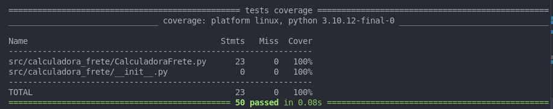
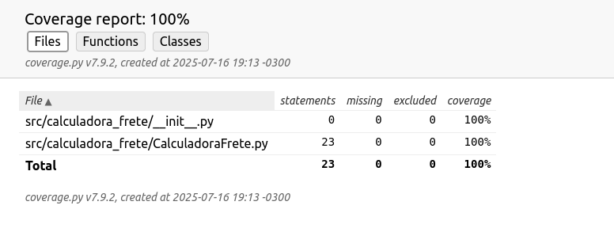

# Projeto de testes de software.

# Guia para Rodar Testes com Cobertura usando `uv` e `pytest-cov`

### 1. Instale as dependências no seu ambiente `uv`:
```bash
uv add pytest pytest-cov
uv activate
```

pytest --cov=CalculadoraFrete --cov-report=term-missing --cov-report=html tests/

### 2. Ajuste o `PYTHONPATH` para a pasta onde está seu código (caso necessário):

**No Linux/macOS:**
```bash
export PYTHONPATH=src
```

**No Windows (cmd):**
```cmd
set PYTHONPATH=src
```

### 3. Execute o script de testes conforme seu sistema operacional:

**No Linux/macOS:**
```bash
./run_test_cov.sh
```

**No Windows:**
```cmd
run_test_cov.bat
```


## Cobertura:



